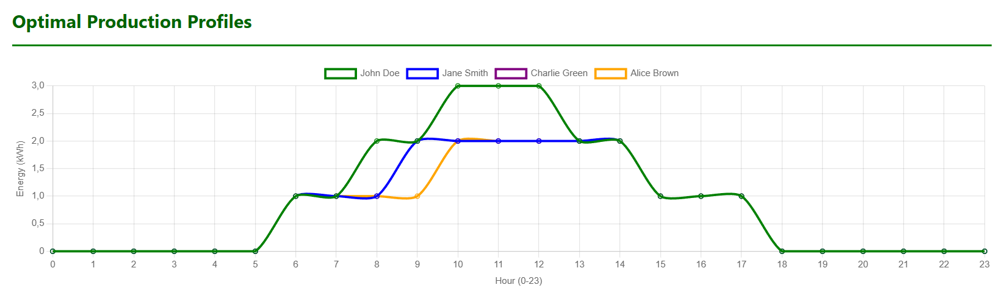
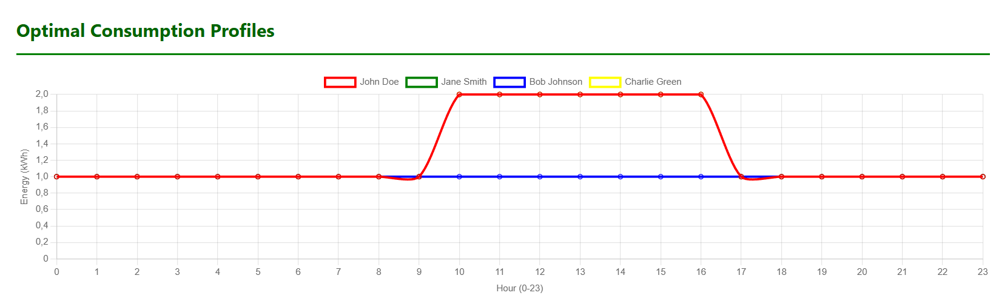
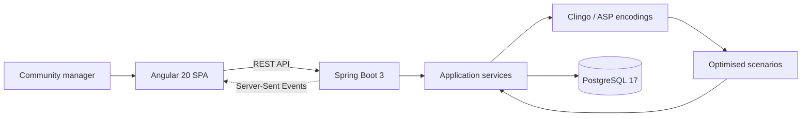

<h1 align="center">PowerHive - Energy Communities</h1>

<p align="center">
  A full-stack decision-support platform for modelling, analysing, and optimising renewable energy communities.
</p>

<p align="center">
  
  
  
  
  
  
</p>

> [!IMPORTANT]
> **Project status - Archived.** PowerHive was developed as a University of Calabria academic project using Scrum and Jira. This repository preserves the final submitted version and is not under active maintenance.

## Overview

PowerHive helps an energy-community manager evaluate how member profiles, community composition, and battery investments affect shared energy and economic performance.

The application combines an Angular dashboard, a Spring Boot REST API, PostgreSQL persistence, and Answer Set Programming through Clingo. Rather than providing only descriptive charts, PowerHive can explore alternative configurations and return optimised scenarios that support operational and investment decisions.

## Core workflow

1. Register or sign in as a community manager.
2. Create an energy plan and add members manually or through CSV import.
3. Associate one or more hourly production or consumption profiles with each member.
4. Select an optimisation analysis and its eligible members, batteries, budget, or constraints.
5. Run the analysis synchronously or asynchronously.
6. Inspect energy charts, community composition, battery allocation, and financial indicators.
7. Save results to the analysis history for later comparison or reuse.

## Optimisation analyses

| Analysis | Decision supported |
| --- | --- |
| **1. Profile Analysis** | Selects the most suitable energy profile for each member to improve the community's shared-energy performance. |
| **2. Optimal Community Formation** | Searches combinations of candidate members and identifies the community composition that maximises energy sharing. |
| **3. Community Adjustment Optimisation** | Evaluates additions and removals from an existing community to find a more efficient balance. |
| **4. Optimal Battery Assignment** | Selects producers and battery models within a budget, schedules charging and discharging, and evaluates the investment return. |

Additional capabilities include plan-conflict handling, reusable saved communities, real-time execution updates through Server-Sent Events, asynchronous analyses, result persistence, and interactive chart controls.

<table>
  <tr>
    <td align="center">
      
    </td>
    <td align="center">
      
    </td>
  </tr>
  <tr>
    <td align="center"><strong>Production-profile comparison</strong></td>
    <td align="center"><strong>Consumption-profile comparison</strong></td>
  </tr>
</table>

<p align="center"><sub>The interface and charts use demonstration data.</sub></p>

## Architecture



| Layer | Main responsibilities |
| --- | --- |
| Angular frontend | Authentication flow, plan and member management, analysis configuration, history, and Chart.js visualisation |
| Spring Boot backend | REST endpoints, validation, application services, persistence, security configuration, and asynchronous execution |
| Clingo / ASP | Combinatorial reasoning for profile selection, community formation, community adjustment, and battery assignment |
| PostgreSQL | Users, plans, members, profiles, batteries, ongoing analyses, and saved history |
| Docker Compose | Local orchestration of the frontend, backend, and database |

## Scrum, Agile, and Jira

PowerHive was delivered incrementally through four Scrum sprints. Jira was used to maintain the product backlog and connect work items to implementation. The `EC-###` issue identifiers are retained throughout the Git history in feature branches, bugfix branches, commits, and pull requests, providing traceability from backlog item to source change.

The team's working cycle was:

```text
Jira backlog item (EC-###)
    → Sprint Planning and Sprint Goal
    → feature/bugfix branch
    → implementation and tests
    → pull request and continuous integration
    → Sprint Review and stakeholder demo
    → Retrospective and improvement actions
```

### Scrum events and artefacts

- **Product Backlog:** managed in Jira and refined into implementation-ready `EC-*` items.
- **Sprint Planning:** selected a coherent increment and established a Sprint Goal.
- **Daily Scrum:** used throughout the recorded sprints to coordinate the self-organising team.
- **Definition of Done:** combined implementation, testing, integration, review, and a demonstrable increment.
- **Sprint Review:** presented completed functionality and collected stakeholder requests.
- **Sprint Retrospective:** recorded successes, problems, and concrete changes for the following sprint.
- **Increment:** each sprint produced working software rather than documentation-only output.

### Incremental delivery

| Sprint | Goal and delivered increment | Evidence |
| --- | --- | --- |
| **Sprint 1** | Established the full-stack foundation, initial plan/member workflows, the first Clingo-backed analysis, and the team's delivery practices. | [Retrospective](docs/scrum/sprint_1/First%20Retrospective.csv) |
| **Sprint 2** | Improved UI and security; delivered plan management, the first three analyses, and analysis history. | [Review](docs/scrum/sprint_2/PowerHive%20Review%202.pdf) · [Retrospective](docs/scrum/sprint_2/Second%20Retrospective.csv) |
| **Sprint 3** | Added richer chart comparison, plan-conflict handling, reusable communities, battery management, asynchronous profile analysis, battery assignment, ROI analysis, and saved results. | [Review](docs/scrum/sprint_3/PowerHive%20Review%203.pdf) · [Retrospective](docs/scrum/sprint_3/Third%20Retrospective.csv) |
| **Sprint 4** | Completed member/battery selection, persistence and deletion for every analysis type, improved financial logic, chart tooling, fully asynchronous execution, and final UI/UX refinements. | [Review](docs/scrum/sprint_4/PowerHive%20Review%204.pdf) |

### Continuous improvement

The retrospectives document how the process evolved instead of treating Scrum as a fixed ceremony:

- Technical debt was made visible and converted into follow-up work.
- Merge conflicts led to earlier, better-organised pull requests.
- Testing gaps led to testing features before merging them into `main`.
- Definition-of-Done issues led to more deliberate error analysis beyond automated checks.
- Communication about newly completed features was strengthened.
- The team balanced new functionality with regression work and earlier technical debt.

The Jira board itself is not exported in this repository, but its ticket convention and development traceability remain visible in the Git history.

## Engineering practices

- Jira-linked feature and bugfix branches
- Pull-request-based integration
- Backend unit and service tests with Maven
- Frontend component and service specifications
- GitHub Actions continuous integration
- SonarCloud static analysis
- Docker image scanning with Trivy
- Container publication to GitHub Container Registry

## Running the project

### Docker Compose - recommended

Requirements:

- Docker Engine or Docker Desktop
- Docker Compose

From the repository root, use the original project startup command:

```bash
docker-compose up --build
```

After startup:

| Service | Address |
| --- | --- |
| Angular application | `http://localhost:4200` |
| Spring Boot API | `http://localhost:8080` |
| Swagger UI | `http://localhost:8080/swagger-ui/index.html` |
| PostgreSQL | `localhost:5555` |

Stop the containers with:

```bash
docker-compose down
```

The credentials in `docker-compose.yml` are development defaults and must not be reused in a production environment.

### Local development

Start PostgreSQL first, then run the backend.

macOS or Linux:

```bash
cd energycommunities
./mvnw spring-boot:run
```

Windows:

```powershell
cd energycommunities
mvnw.cmd spring-boot:run
```

In a second terminal, start the Angular frontend:

```bash
cd energycommunities-ng
npm ci
npm start
```

The original Angular CLI command is also supported after installing the project dependencies:

```bash
ng serve
```

## Technology stack

- Angular 20, TypeScript, RxJS, Chart.js, and ng2-charts
- Java 21 and Spring Boot 3.5
- Spring Web, Data JPA, Security, Validation, and springdoc-openapi
- Clingo and Answer Set Programming
- PostgreSQL 17 and H2 for development/testing scenarios
- Maven, npm, Docker, and Docker Compose
- GitHub Actions, SonarCloud, Trivy, and GitHub Container Registry
- Jira and Scrum for Agile project management

## Repository structure

```text
powerhive-energy-communities/
├── energycommunities-ng/   # Angular frontend
├── energycommunities/      # Spring Boot backend and ASP encodings
├── docs/scrum/             # Sprint Reviews and Retrospectives
├── .github/workflows/      # CI, quality, security, and release workflow
├── docker-compose.yml      # Full local environment
└── sonar-project.properties
```

## Academic context and team

Developed at the **University of Calabria - DeMaCS** as an academic software-engineering project.

- Giuseppe Rudi
- Francesco Cristiano
- Francesco Filocamo
- Eugenio Ielpa
- Pierluigi Trocini

## Archive notes

- The repository represents the final academic increment and is not a production deployment.
- Sprint documents preserve the evolution of requirements, implemented features, reviews, and process improvements.
- The source includes demonstration configuration and data; no production dataset or environment is distributed.
- Archived dependencies or external services may require adjustment in a future environment.

## License

No licence file is currently included. Public availability of the source code does not grant additional reuse rights beyond those provided by applicable law.
